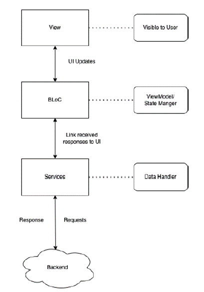
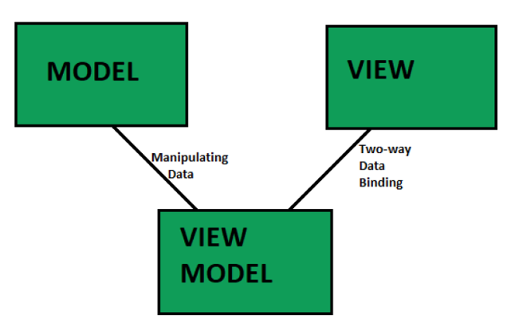
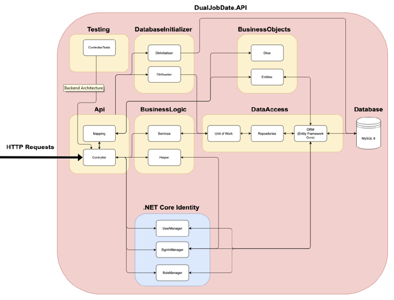
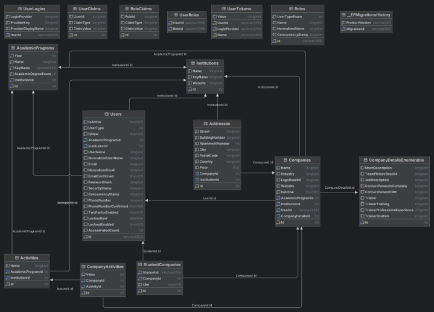

# dual-job-dating

## Description & Contributors

This is an open source project for creating a platform for dual job dating. The project is developed by students of Mobile Software Development (MSD21) at the University of Applied Studies in Kapfenberg, Austria. The project was supervised by FH-Prof. DI Dr. Elmar Krainz, DI (FH) Michael Ulm, MA, and DI (FH) Andreas Öffl, MSc.

## Installation

The project is divided into three parts.. The frontend consists of a Flutter application and an Angular application, while the backend is a ASP.NET Core application. The following instructions will guide you through the installation process.

### Installation steps

#### Flutter App

1. Clone the repository

2. Navigate to the `this-directory` directory

3. Install the required dependencies

...

4. Run the application

#### Angular App

1. Clone the repository

...

#### ASP.NET Core App

1. Clone the repository

...

## Usage

Starting from the third semester, dual studies at FH JOANNEUM allow students to alternate between academic instruction and part-time employment at various companies, providing practical, industry-specific experience. The "Dual Job Dating" app is designed to facilitate job matchmaking between students and patner companies. It allows students to browse company profiles, express their preferences through likes or dislikes, and receive appointment schedules based on their choices for the job dating event. Additionally, the app includes a web-based component for administrative management of the entire process by both the educational institution and the participating companies.

### Instructions for use

### Screenshots

## Technical Details

### Tech stack

### Architecture

#### App Development with Flutter

- UI Layer: Uses singular components for screens, focusing on user experience​

- BLoC Layer: Interface between UI and Services. Manages state and separates business logic for readability​

- Services Layer: Contains logic for external interactions like API calls. Aimed at decoupling the application core from external dependencies​

- Additional Classes: Enhances code with static helpers for UI consistency and validation

#### Web Development with Angular

- Model: Encapsulates the application's business objects, holding data. It's the reusable code part that simply manages the data of the application​

- View: What the user ultimately sees. It's the platform-specific UI that displays formatted data. The View is designed to present data contained in the Model​

- ViewModel: Acts as the link between the Model and View, handling logic and data preparation for the View. It retrieves data from the Model and formats it for presentation​

#### Backend Development with ASP.NET Core

- API Layer: Interfaces with the client side, handling HTTP requests via Controllers. ​

- Business Logic Layer: Processes business operations, implemented by Services, and aided by Helper functions for shared utility tasks.​

- Data Access Layer: Manages the data lifecycle with Repositories handling data transactions and the Unit of Work ensuring data integrity.​

- Business Objects: Comprise DTOs (Data Transfer Objects) and Entities, forming the data structure used across Business Logic and Data Access layers.​

- Database Initialization: Involves DbInitializer for database setup and DbSeeder for seeding initial data.​

- .NET Core Identity: Secures the application with comprehensive user and role management using UserManager, SignInManager, and RoleManager.​

### Database schema

- User and Role Entities: Core Identity framework entities where User inherits from IdentityUser and Role from IdentityRole, central to the system's security and access management.​

- UserType Enumerations: Specific roles including Admin, Institution, Company, and Student, dictating access privileges and functional scope within the system.​

- Institution and Academic Program Relationships: Hierarchical relation where Institutions may contain multiple Academic Programs, integral for structuring the educational offerings within the system.​

- Company and Academic Engagement: Defines the linkage between companies and academic programs, vital for capturing interactions such as internships.​

- Seeding and Initial Data: DbSeeder's role in populating the database with initial, essential data sets, such as predefined user roles and academic program details.​

### API documentation

## License

[MIT License](LICENSE)

## Contact

For any questions or feedback, please contact us at:

https://www.fh-joanneum.at/msd
Email: msd@fh-joanneum.at
Tel: +43 316 5453 - 6332
